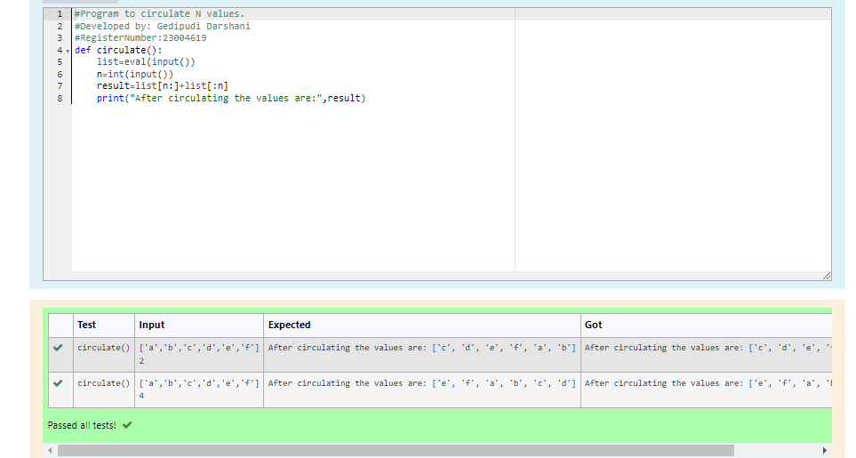

# Circulate-the-values-of-N-variables
## Aim:
To write a python program to circulate the n variables using function concept
## Equipment’s required:
PC
Anaconda - Python 3.7
## Algorithm: 
### Step 1:
Start the program using function def circulate(). 
### Step 2: 
Prepare the lists from the given values of input.
### Step 3: 
Get the value from the user for the number of rotation
### Step 4: 
Using the slicing concept rotate the list.
### Step 5: 
Print the statement according to the output dispayed.
### Step 6:
End the program 
## Program:
``````
#Program to circulate N values.
#Developed by: Gedipudi Darshani
#RegisterNumber: 23004619
def circulate():
    list=eval(input())
    n=int(input())
    result=list[n:]+list[:n]
    print("After circulating the values are:",result)
``````
## Output:

## Result:
Thus the solutions for circulating N values are successfully solved using python programming.
